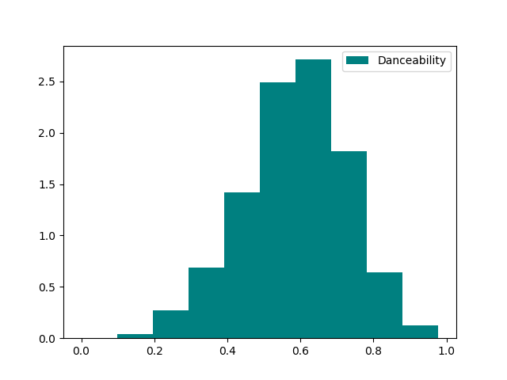
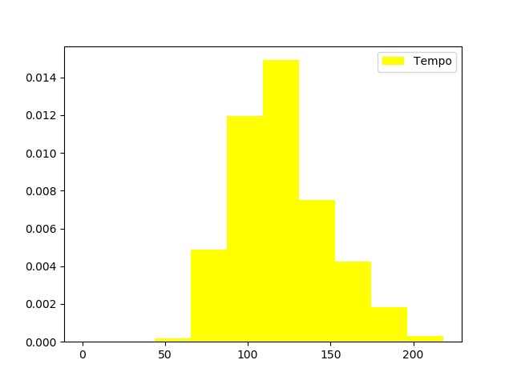
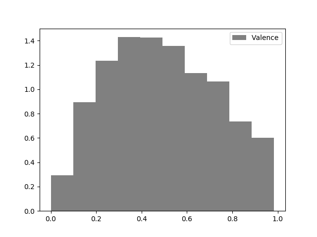
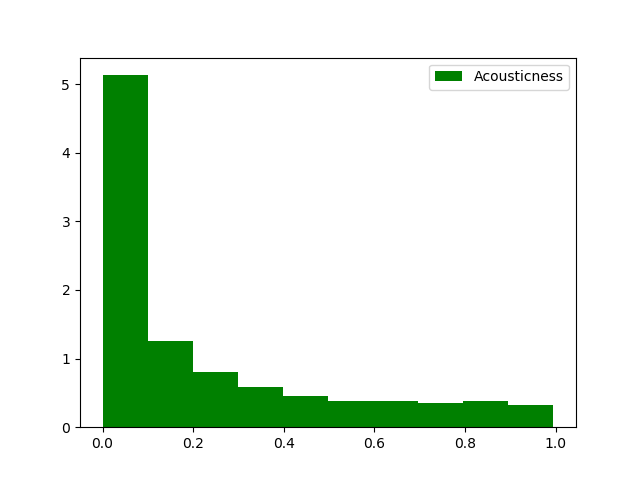
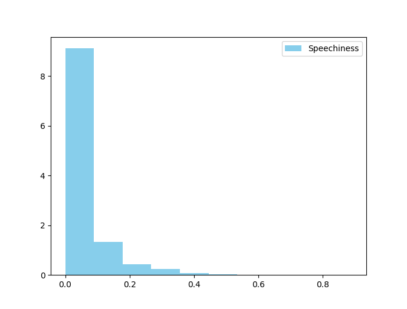

# Project Midterm Report
## Clay Wang, Medhavi Gandhi

### Overview

The music industry impacts our everyday lives. Even our very own president Martha Pollack has noticed this trend of students always listening to music. Being able to find the features that make a song popular would be the key for artists to produce hits. Our project seeks to determine the feasibility of predicting popularity of songs using various features of songs.

### Raw features

Below are some of the features and description of the features used below. This is the raw data that we obtained from our data source, without any transformations.

|  Feature |  Value Type | Description  |
|:---------|:-------------|:-----------|
| duration_ms | int | Duration of song in milliseconds |
| key | int | The overall key of the song, where 0 = C, 1 = C#, etc. |
| mode | int | 0 = Major, 1 = Minor |
| acousticness | float  | Rating from 0 to 1 on how acoustic songs are |
| danceability | float  | Rating from 0 to 1 on how suitable a song is for dancing |
| energy  | float  | Measure from 0 to 1 that represents a measure of intensity  |
| instrumentalness | float | Measure from 0 to 1 that represents the likeliness of containing no vocal content |
| loudness | float | Loudness of song in decibels |
| speechiness | float | Measure from 0 to 1 |
| valence | float | Measure of how happy a song is from 0 to 1 |
| tempo | float | Tempo of track in beats per minute |
| release_year | int | Year that the song was released |
| artist  | string  | The lead artist of the song |

### Visualizations of Raw Data

Below are histogram plots of certain features (Valence, Tempo, Danceability, Speechiness, Acousticness) as well as a histogram of the popularity of songs in our dataset.

### Feature Transformations

Lots of the features we are considering are already normalized for us. For example, **danceability** is already a float from 0 to 1. However, we also have some data that would benefit us in other formats. For example, **release_year** might be better used as a categorical variable, such that we are able to develop a non-linear model based off the feature. Another feature that is categorical is **artist**, as we can draw a conclusion that there are certain artists that are already quite famous, and any song that they produce be more likely to be popular (i.e. Drake). We express these categorical variables using one-hot encoding.

Furthermore, we also may want to incorporate some polynomial transformations to capture some non-linear features.

### Preventing Overfitting and Underfitting

To prevent overfitting, we use a train-test split of 80% training and 20% test. Furthermore, we also treat our data as a time series of sorts, where all songs in the training set are released before the song in the test set. This is to mimic how we would actually use the model in a live environment.
Furthermore, we also don’t want to test too many models, as it’s possible that we eventually end up fitting to the test data set.
We also want to examine the correlation between the features and popularity, to make sure that the features we are considering are actually useful. By removing useless features, we can simplify our model and try to prevent over-fitting.

To prevent underfitting, we also want to try to add some more complexity to our models. To do this, we can go beyond simple linear regression and try various degrees of polynomial. We also can explore various models such as random-forest regression and SVM regression, which can help identify non-linear patterns in our data. We also plan on deriving new features from our old features, such as using a quantile-based feature.

### Some Simple Regressions and Analysis

| Regression Type |  Mean Average Error |
|:---|:---|
| Linear Regression | 20.106  |
| Polynomial Regression (Degree 2) | 20.155  |
| Random Forest Regression  | 21.024  |
| Ada Boost Regression  | 20.125   |
| Gradient Boosted Regression  | 20.125   |
| K Neighbors Regression | 20.031  |
| SVM Regression  | 21.904  |

From these results, we can see so far that there is no significant model that performs better than the other. Our hypothesis is that our dataset is including songs that are decades old, which may not actually be providing helpful signals to predict popularity of modern songs. Furthermore, our data may be skewed, as we don’t have enough popular songs to test, and many of our songs have popularity 0.

### What's Next?

Currently, our model is not robust enough. We plan on executing the following plans:

* Train an individual model on songs for each year, and evaluate the model on the songs from the following year. Ideally, this would capture only the most recent trends in music, and thus won’t be influenced by songs from previous generations
* Add various features derived from features. We would potentially add some quantile-based features.
* Explore training models for each individual artist. For example, artists may be more talented at producing “danceable” music than others.
